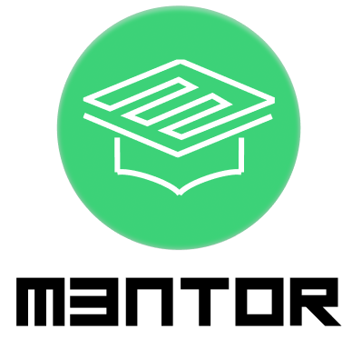

  

<h1 align="center">Sistema de Gestión de Interacción entre estudiantes y docentes</h1>

MENTOR es una plataforma académica orientada a la gestión de interacción entre estudiantes tesistas y docentes tutores. Permite registrar y gestionar proyectos, enviar solicitudes de tutoría, asignar tareas, y mantener una comunicación constante entre los participantes del proceso de tesis.

---

## 📌 Descripción

El sistema busca centralizar y agilizar el proceso de aprobación de perfil de grado, permitiendo:
- Registro y autenticación de estudiantes y tutores mediante correo institucional.
- Creación y gestión de proyectos grupales.
- Envío y revisión de solicitudes de tutoría.
- Asignación, seguimiento y revisión de tareas.
- Sistema de chat en tiempo real.
- Intercambio de documentos y feedback.
- Generación del documento de aprobación de perfil de grado.

---

## 🚀 Versión Actual

**Versión:** 1.0  
---

## 🛠️ Tecnologías Utilizadas

- **Frontend:** ReactJS
- **Backend:** Firebase (Authentication, Firestore, Cloud Storage)
- **Librerías y herramientas:**
  - React Router DOM
  - Firebase SDK
  - Cloudinary (para imágenes y archivos)

---

## 📎 Documentación del Proyecto

### 🔗 Enlaces importantes:

1. **Trello (Gestión de tareas):**  
  - [Trello Board](https://trello.com/invite/b/67e9df1ee25982ca3309693b/ATT165260fae0362f0a849daab2213ddbb5f82C4B9CA/mentor-ps2)

2. **Repositorio en GitHub:**  
  - [MENTOR en GitHub](https://github.com/Huicho06/PR-25-MENTOR.git)

---

### 📄 Documentos y Manuales:

1. **📘 Requerimientos del Proyecto:**  
- [Documento de Requerimientos](https://univalleedu-my.sharepoint.com/:w:/g/personal/mmm0033334_est_univalle_edu/Ebq1DzHOu8dIg0_89cRFV-cBu4CsMkVGtep64brihnVflg?e=WPrA7Q)

2. **📙 Manual de Base de Datos:**  
- [Manual de Base de Datos (Video)](https://univalleedu-my.sharepoint.com/:v:/g/personal/mmm0033334_est_univalle_edu/ERoWj6sk-QlNhnPuCR4KMVYBP3zE3YgFtXkBIiaSA_3zDA?e=HilZlU)

3. **⚙️ Manual Técnico:**  
- [Manual Técnico (Video)](https://univalleedu-my.sharepoint.com/:v:/g/personal/mmm0033334_est_univalle_edu/EUCZpBs3k-ZGn-f1cSY9TzoBXDIyKBL6OGQpN9aX6ZYtBA?e=nuHWhP)

4. **👤 Manual de Usuario:**  
- [Manual de Usuario (Video)](https://univalleedu-my.sharepoint.com/:v:/g/personal/mmm0033334_est_univalle_edu/EQvyMPvHcp5PoG06iTP2ep8BqVEt32Gufav94mr44sUnoA?e=wNoiIV)

---

## 👥 Integrantes del Proyecto

- **Marcelo Mena Molina**
- **Jesús Diego Espejo Aguilera**

---

## 📩 Contacto

- 📧 mmm0033334@est.univalle.edu
- 📧 eaj0033775@est.univalle.edu
---

  

